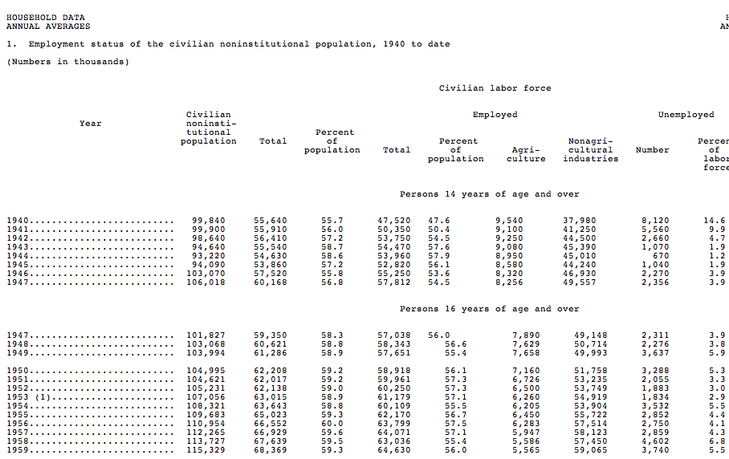

This is official unemployment data from the US Government Bureau of Labor Statistics:

ftp://ftp.bls.gov/pub/special.requests/lf/aa2010/aat1.txt

This dataset of long-term employment is a wonderful example of an "ASCII Spreadsheet" including what "merge cells" looks like in plain text (see the Employed heading).

It also is a good example of a data structure (as opposed to format) which is "human readable" but not [machine readable][mr].

You can find a cleaned version of the data at https://github.com/datasets/employment-us and the clean up script is at https://github.com/datasets/employment-us/blob/master/scripts/process.py

[mr]: http://okfn.org/opendata/glossary/

