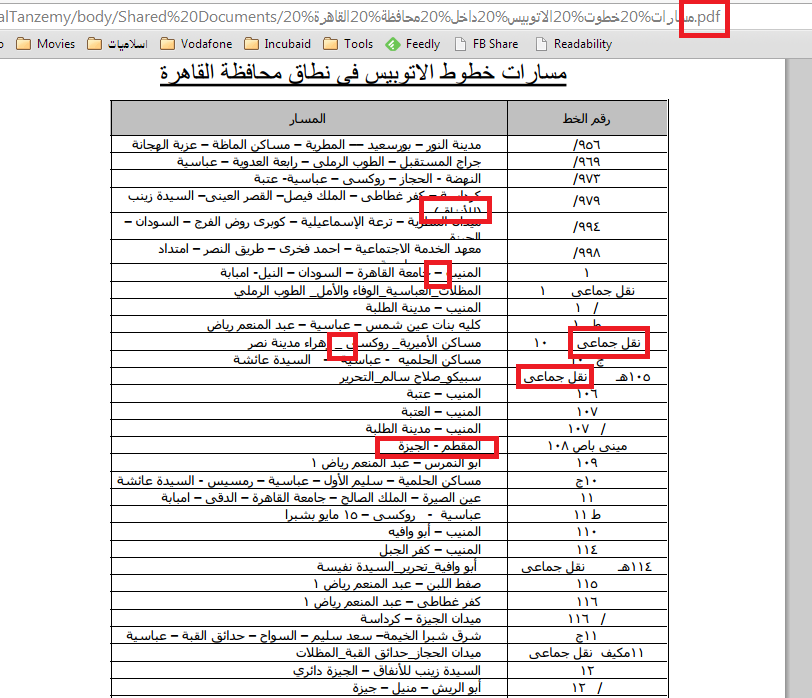
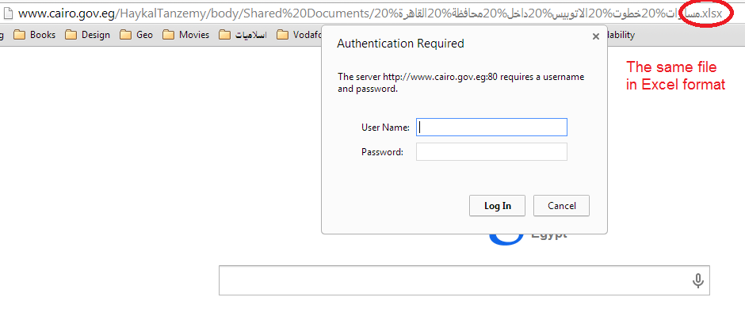
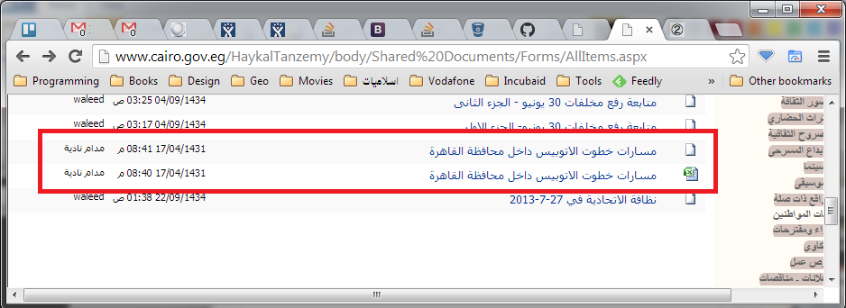

Mohammad Tayseer (http://mtayseer.net/) writes about PDF data from Governorate of Cairo.

http://www.cairo.gov.eg/HaykalTanzemy/body/Shared%20Documents/%D9%85%D8%B3%D8%A7%D8%B1%D8%A7%D8%AA%20%D8%AE%D8%B7%D9%88%D8%AA%20%D8%A7%D9%84%D8%A7%D8%AA%D9%88%D8%A8%D9%8A%D8%B3%20%D8%AF%D8%A7%D8%AE%D9%84%20%D9%85%D8%AD%D8%A7%D9%81%D8%B8%D8%A9%20%D8%A7%D9%84%D9%82%D8%A7%D9%87%D8%B1%D8%A9%20.pdf

# What's bad?

1. The file is in PDF format, which is very hard to parse.
2. There is another copy in Excel format, but it asks for credentials!
3. Stations are jammed into a single cell, sometimes separated by dashes, sometimes by underscores.
4. Stations are written in many different ways. Sometimes with the complete name. Sometimes written as shortcuts. Sometimes there are spelling mistakes.
5. Sometimes the names of stations are hidden
6. No consistent numbering of lines
7. A lot of lines are defined by start & end stations only, not mentioning the intermediate lines, making it impossible for anyone to know the route of the bus.
8. The data is not updated for more than 3 years

# Screenshots

## The data

## The Excel credentials prompt

## Last updated 3 years ago

