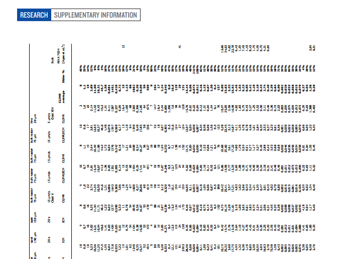

Ross Mounce (http://rossmounce.co.uk/) writes regarding Nature Magazine's PDF supplementary information:

http://www.nature.com/nature/journal/vaop/ncurrent/extref/nature12764-s1.pdf

[Nature Magazine](http://www.nature.com) tends to publish fabulous cutting-edge scientific research data of different types bundled all together in a PDF called "supplementary information".

In this example, they have bundled together: 

* words
* image data
* scatterplot data
* a bar chart
* some awful sideways printed tables of numbers

... some say this is one of the world's "best" research journals.