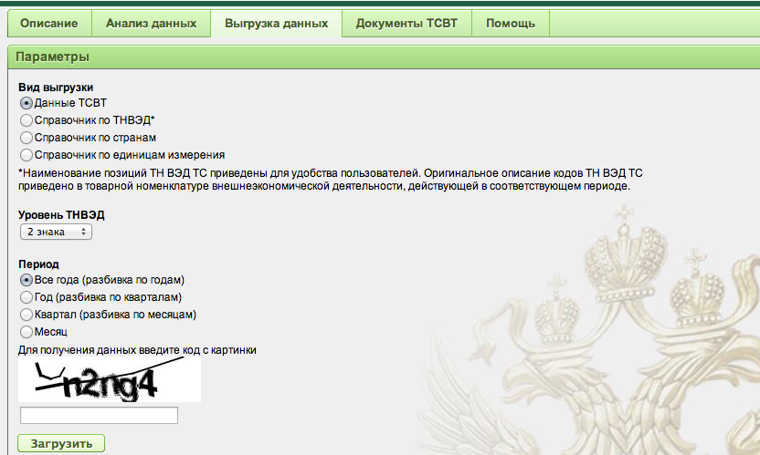

Ivan Begetin (http://infoculture.ru/) writes about Russian Federal Customs Service DBF (dBase) data published at:

http://stat.customs.ru/apex/f?p=201:3:822234424961570::NO:::

What's wrong with this dataset he asks?

* Impossible to download whole dataset at once. No bulk download.
* For each data slice, you have to enter a CAPTCHA.
* Data format DBF (DBase) is proprietary.