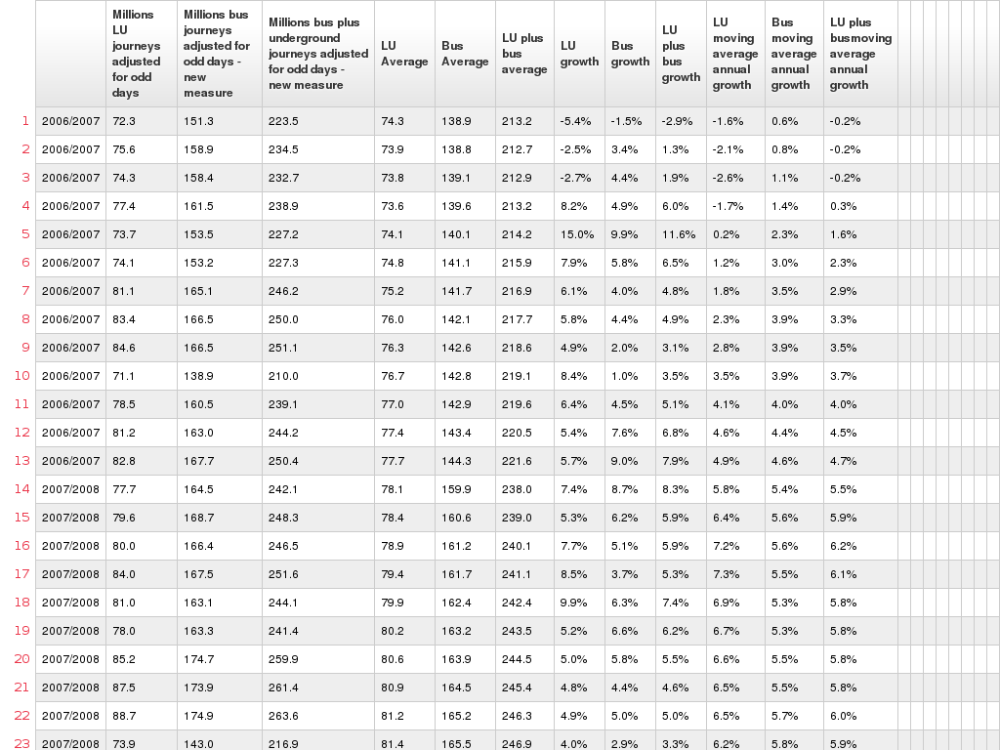

The Greater London Authority London Datastore publishes this CSV about Transport for London (TfL) passenger numbers. 

http://data.london.gov.uk/datafiles/transport/tfl_passengers.csv [Cached version](/data/tfl_passengers.csv)

The problem is the CSV is so messy only a human could use it! What specifically is wrong?

* The first column is missing a heading (one guesses this should be "date"?)
* Dates are not of a recognizable format instead being of form: "2006/2007 - 1". One assumes this should be a month or similar (but its not entirely clear if these are months since 13 items in a year!)
* Percentage sign written into percentage column
* Large number of trailing blank rows and columns